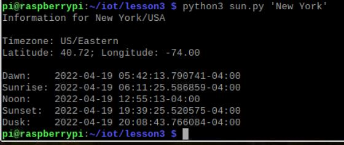

# DOCUMENTATION FOR LABS 3

## julian.py

## date_example.py

## datetime_example.py

## time_example.py

## sun.py

## moon.py

## coordinates.py

## address.py

## cpu.py

## battery.py

## documentstats.py

