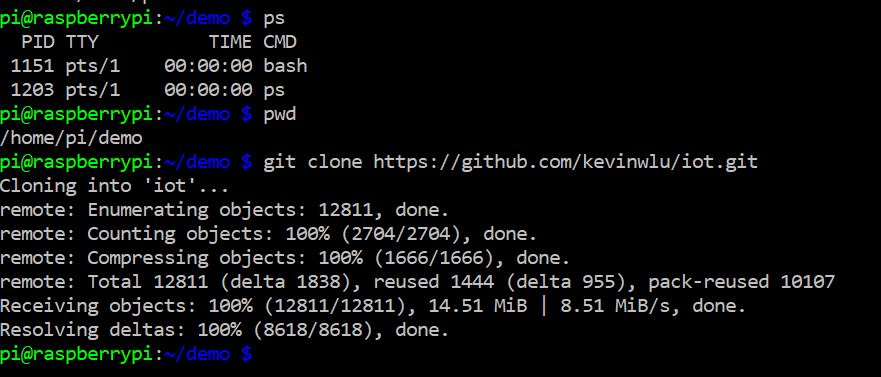
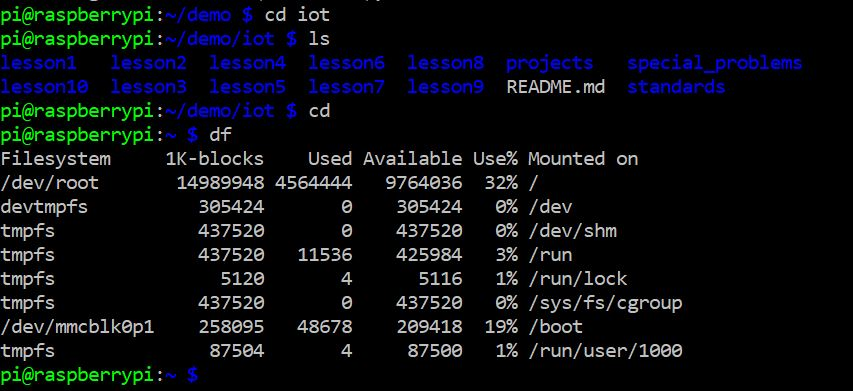
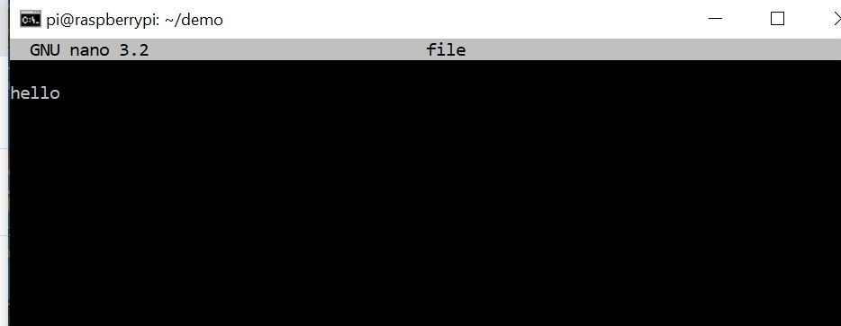
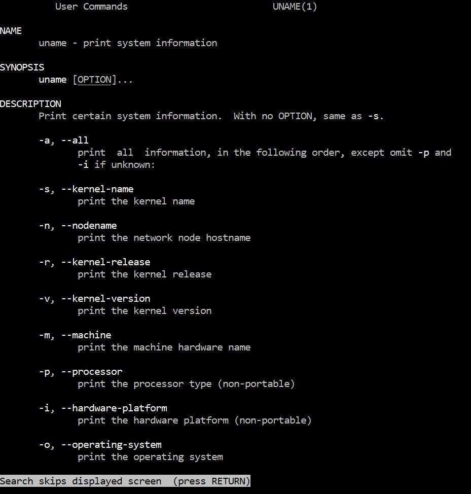
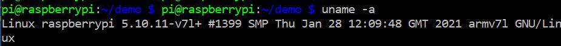
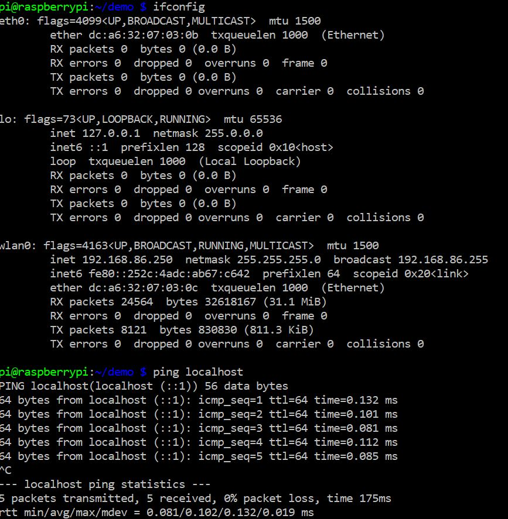
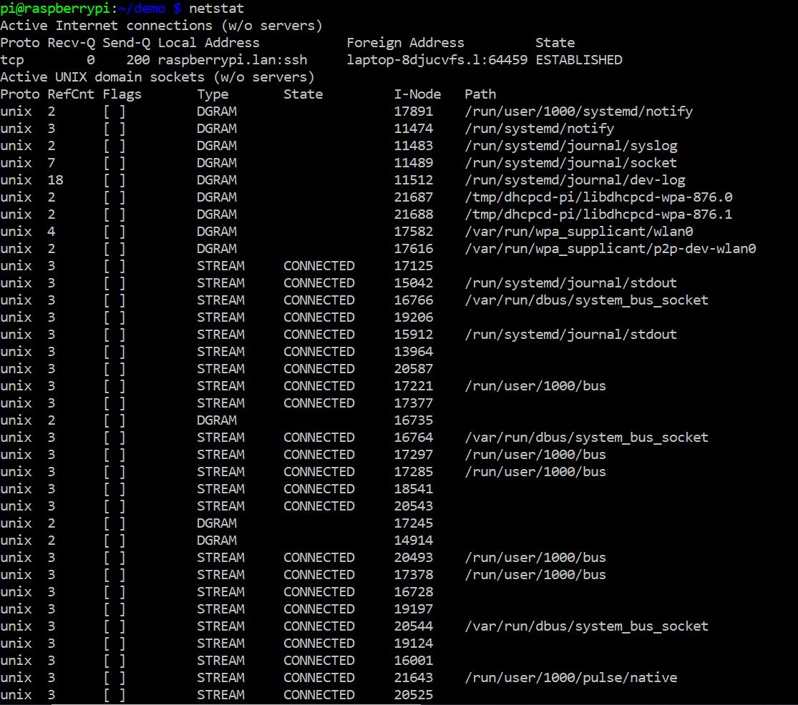

# Lab 1 & 2 Documentation
## These labs introduce basic git commands that are accessed through an ssh connection

## Hostname // env

## ps // pwd // clone

## cd // ls // df

## nano

## uname

## uname -a

## ifconfig // ping localhost

##netstat

