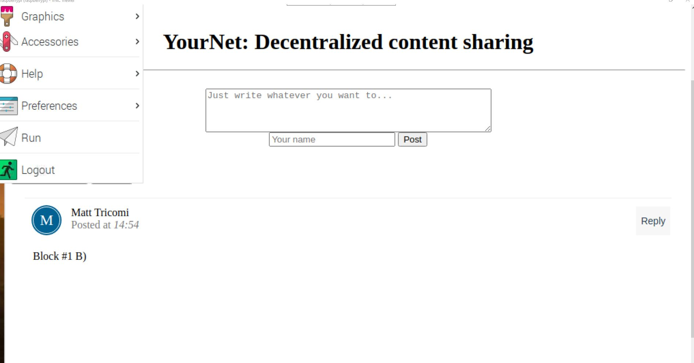
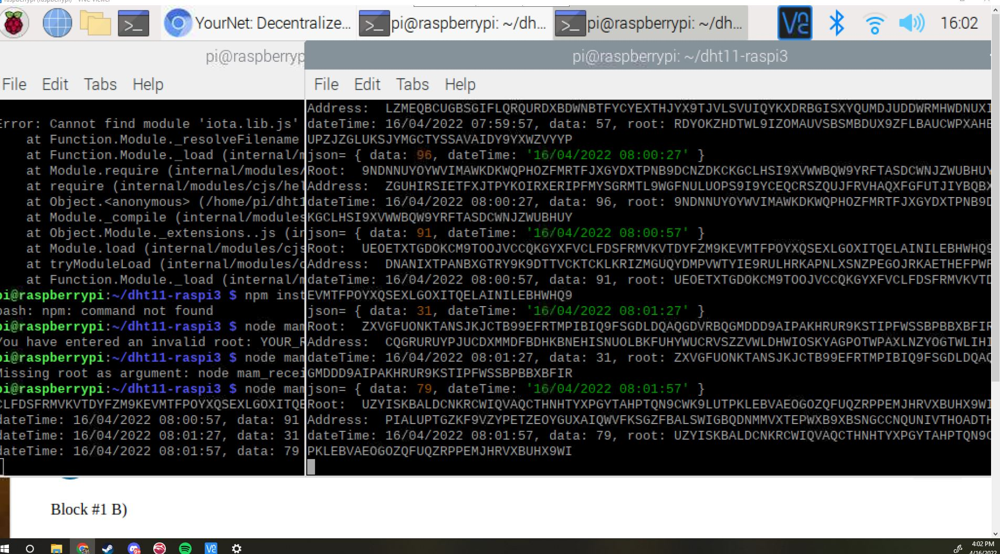

# Lab 10 Documentation
## In this Lab, we aim to create a small blockchain application
# My Blockchain

## Also, send data from 1 terminal to the other using a node server

## Data is passed by using mam_publish.js on Terminal 1, and mam_receive on Terminal 2
